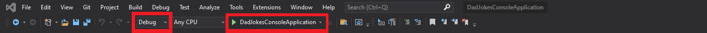

# Dad-Joke-Generator

### General Messages
The Dad Joke Generator is a Console application written in C#. This program works on Windows, macOS.

## Requirements

Visual Studio 2019 with .NET Core 3.1 or higher and Git;

**Visual Studio**
Install the program from this [site](https://visualstudio.microsoft.com/), the installation guide is provided in this [site](https://docs.microsoft.com/en-us/visualstudio/install/visual-studio-enterprise-guide?view=vs-2022);  

**.NET Core 3**
To see if .Net Core is installed in your computer, open the Windows Command Prompt, Powershell or a similar command line tool, and type `dotnet --version`(on Mac and Windows). If the .NET Core is not already installed on the computer, you will get an error as it will not be able to recognize the command. [Program installation file](https://dotnet.microsoft.com/download) and [installation process guide](https://docs.microsoft.com/en-us/dotnet/framework/install/dotnet-35-windows) are provided in Microsoft page.

**Git**
To see if Git installed in your computer, open the Windows Command Prompt, Powershell or a similar command line tool, and type `git version` (on Mac and Windows). To install Git on your computer, visit https://git-scm.com/downloads. If you'd like a step-by-step [guide](https://git-scm.com/book/en/v2/Getting-Started-Installing-Git) this tutorial provides simple instructions for users to follow.

### Set up the application ####
1. Download the app from the Git. Use the Windows Command Prompt, Powershell or a similar command line tool, put in it:
   `git clone https://github.com/Lauramin/DadJokeGenerator.git`
   Or navigate to the top level of the project and then a green "Code" download button will be visible on the right. Choose the Download ZIP option from the Code pull-down menu.
2. Find the directory where a files are located. Use the Windows Command Prompt, Powershell or a similar command line tool, put in it:
   `dir DadJokesConsoleApplication.sln /s /p` (on Windows)
    Or to find the file use **Window Explorer (Windows)** or **the Finder (on mac)**.
   
## Running the application using Visual Studio ##
1. Open a Visual Studio;
2. Choose `Open a project or solution` from the Build menu. If necessary navigate through the application's folder to `DadJokesConsoleApplicartion.sln` file. 
3. To run the application, use the menu bar (on your right), choose **Debug** button and when -> **Start without debugging** or use: `F5` shortcut for a Windows\
   \
   To run the application, use the Solution bar (on your left), choose **DadJokesConsoleApplication (main)** click right button -> **Run Solution** for a Mac\
   
4. A console will open and the application will start.
